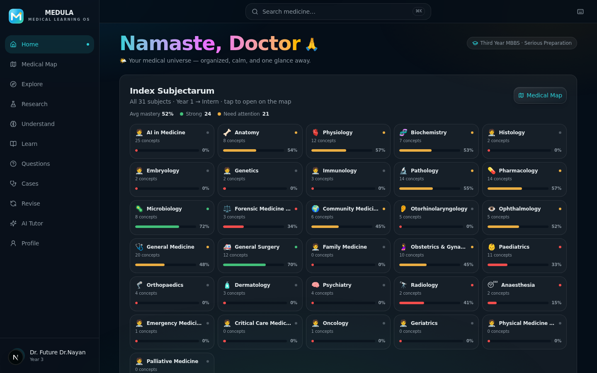
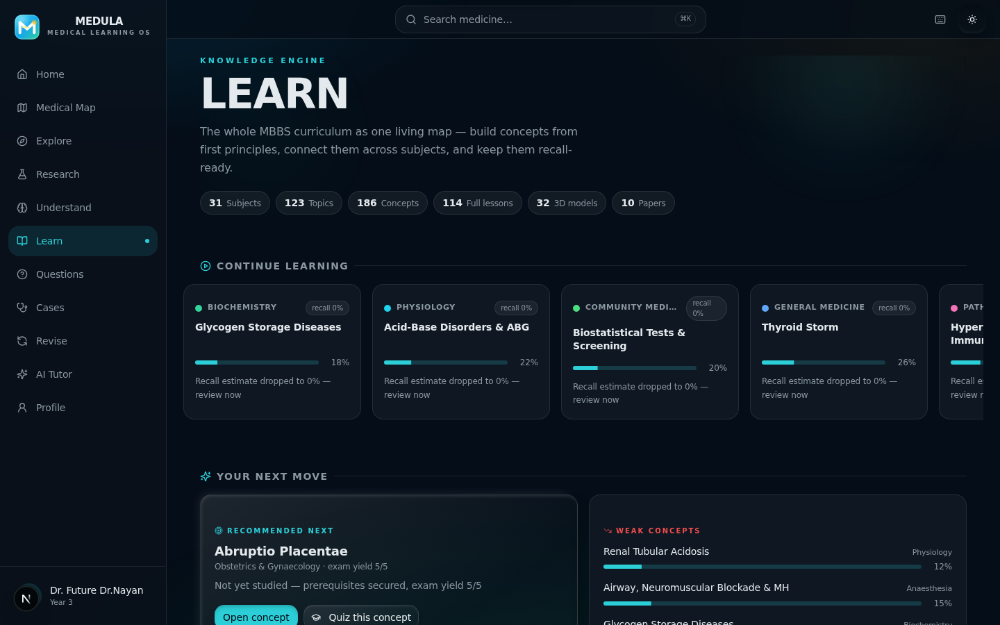
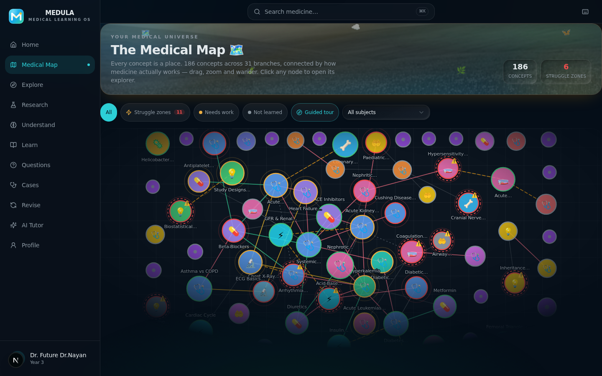
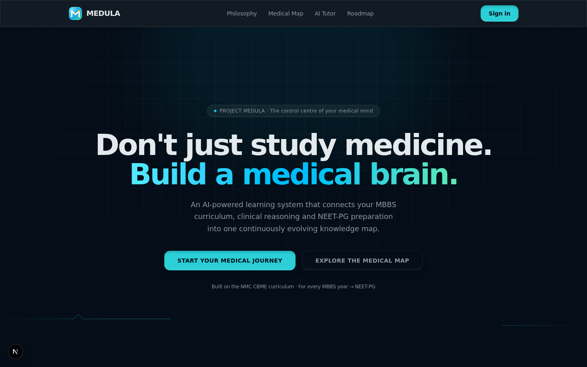

<div align="center">

# 🧬 MEDULA

### The Medical Learning Operating System

**Don't just study medicine. Build a medical brain.**

An AI-powered learning system that connects the MBBS curriculum, clinical reasoning and NEET-PG preparation into one continuously evolving knowledge map.


</div>

---

## 📸 A Look Inside

| | |
|:---:|:---:|
| **Dashboard — *Namaste, Doctor* 🙏** <br/> *Index Subjectarum* — every MBBS subject, one calm grid | **Learn — The Knowledge Engine** <br/> The whole curriculum as one living map |
|  |  |
| **Medical Map** <br/> Every subject, system and concept — connected | **Landing** <br/> *"Built on the NMC CBME curriculum · For every MBBS year → NEET-PG"* |
|  |  |

---

## ✨ What is MEDULA?

MEDULA is a **single, connected medical brain** instead of a pile of PDFs. It is built around one loop:

> **learn → connect → forget a little → repair → repeat.**

Everything in the app feeds everything else — a concept you study in **Learn** sharpens your **Medical Map**, spawns **flashcards** in **Revise**, surfaces in the **Question Lab**, and updates your **readiness score** on the dashboard.

### 🎯 Six instruments, one system

| # | Instrument | What it does |
|:---:|---|---|
| 1 | 🗺️ **Medical Map** | A living graph of the entire MBBS curriculum — every concept a node, colored by mastery, drillable from subject → system → topic → concept |
| 2 | 🧠 **Learn (Knowledge Engine)** | Deep, first-principles lessons for every concept — with mechanisms, differentials, mnemonics, 3D visualizations and a clinical reasoning stepper |
| 3 | ❓ **Question Lab** | Adaptive MCQs and clinical vignettes that target exactly what you're about to forget |
| 4 | 🏥 **Case Simulator** | Step-by-step clinical cases: present → investigate → diagnose → manage |
| 5 | 🔄 **Revise** | Spaced repetition powered by a forgetting-curve model, with error-pattern intelligence |
| 6 | 🤖 **AI Study Coach** | An AI tutor that knows your weak concepts, your exam date and your daily hours |

---

## 🧠 The Knowledge Engine (Learn)

The heart of MEDULA — a complete, structured medical curriculum:

<div align="center">

| 📚 Subjects | 🗂️ Topics | 💡 Concepts | 📖 Full Lessons | 🧊 3D Models | 📄 Papers |
|:---:|:---:|:---:|:---:|:---:|:---:|
| **31** | **123** | **186** | **114** | **32** | **10** |

*Pre-clinical · Para-clinical · Clinical · Specialized · Frontier (AI in Medicine)*

</div>

### Every concept can be understood from first principles

Each full lesson is a progressive-disclosure journey with **tabbed depth**:

| Tab | What you get |
|---|---|
| **Overview** | 30-second version · one-liner · why it matters · ELI5 analogy · exam relevance |
| **Deep dive** | Normal physiology · mechanism / pathophysiology · important numbers · drugs & mechanisms · procedures · imaging & pathology correlation |
| **Clinical reasoning** | Presentation · diagnosis · differentials · management principles (with *verify-current-guideline* flags) · complications · common mistakes |
| **Memory** | Mnemonics · misconception checks · teach-it-back |
| **Global** | 🇮🇳 India vs 🇺🇸 US vs 🇬🇧 UK vs 🌍 WHO — terminology, workflows, screening and training differences, presented neutrally |
| **Connections** | Knowledge-graph links · prerequisites · frequently-confused pairs · cross-subject bridges |
| **Sources** | Honest attribution block — WHO, CDC, NICE, NCBI, Johns Hopkins, Harvard, MIT OCW, OpenStax, NHS, NMC |

> **Content honesty:** sources are used for **attribution only** — content is independently synthesized, never copied. No invented statistics: every quotable number is a standard published teaching value, flagged with a *verify* note where guidance varies.

### 🧊 The 3D Atlas

32 interactive anatomical & physiological visualizations with **rotate / zoom / isolate layers / labels**, guided step-by-step tours, inline quizzes, clinical-correlation cards and normal-vs-abnormal comparisons — every model answers: *What am I looking at? What does it do? What if it fails? What's clinically important?*

### 🤖 AI in Medicine pathway

A full frontier track (25 lessons): LLMs in medicine, imaging AI, model evaluation (AUROC/AUPRC, calibration, dataset shift), hallucination & bias, human-in-the-loop safety, FHIR interoperability, regulatory science — plus **10 real, verifiable research-paper explainers** (Esteva 2017, Gulshan 2016, CheXNet, Med-PaLM…), each with question → method → result → clinical meaning → limitations.

---

## 🗺️ The Full App Tour

| View | Description |
|---|---|
| 🏠 **Home** | The dashboard — *Namaste, Doctor*, the *Index Subjectarum* subject grid, mastery stats, readiness score, today's plan |
| 🗺️ **Medical Map** | Subject → system → topic → concept navigation with mastery heat-coloring and quiz handoffs |
| 🧭 **Explore** | Browse medicine by specialty, disease, drug or mechanism — with AI-seeded deep dives |
| 🔬 **Research** | The Research Hub — literature search, paper explainers and evidence summaries (AI-powered) |
| 💡 **Understand** | Type any medical topic; get a structured, AI-generated explanation ladder |
| 🧠 **Learn** | The Knowledge Engine (above) — curriculum, lessons, 3D Atlas, reasoning, global perspectives |
| ❓ **Questions** | The Question Lab — adaptive quizzes, exam-mode simulation, misconception analytics |
| 🏥 **Cases** | Clinical Case Simulator — branch through presentations, investigations and management |
| 🔄 **Revise** | Spaced repetition, flashcards, due queues and error-pattern repair |
| 🤖 **AI Tutor** | Your personal AI study coach — drill weak concepts, plan around your exam date |
| 👤 **Profile** | The hub — edit your profile, view **Progress** and **Roadmap** digests (with full drill-down views), sign out |

---

## 🏗️ Project Structure

```
medula/
├── src/
│   ├── app/                    # Next.js App Router
│   │   ├── page.tsx            # SPA shell — hash-routed views (#/learn, #/map…)
│   │   └── api/                # 30+ REST route handlers
│   │       ├── auth/           #   demo sign-in (explicit session gate)
│   │       ├── learn/          #   home · curriculum · atlas · papers
│   │       ├── tutor/          #   AI study coach (LLM-powered)
│   │       ├── research/       #   literature search + explainers
│   │       ├── concepts/ graph/ questions/ cases/ revision/ …
│   ├── components/             # One folder per view (21 view families)
│   │   ├── auth/               #   sign-in with "Welcome back" resume gate
│   │   ├── learn/              #   Knowledge Engine hero + lesson renderer
│   │   ├── concept/            #   concept explorer + 3D visualizations
│   │   ├── map/ dashboard/ questions/ cases/ revise/ tutor/ …
│   │   └── ui/                 #   complete shadcn/ui component set
│   ├── lib/
│   │   ├── curriculum/         # Content packs: taxonomy, pre/para/clinical,
│   │   │                       # AI-in-Medicine, papers, registry & merge rules
│   │   ├── store.ts            # Zustand store + session & last-view memory
│   │   ├── engine.ts           # Spaced-repetition / mastery engine
│   │   ├── visual3d.ts         # Handcrafted interactive 3D diagram specs
│   │   └── api.ts db.ts http.ts graph-layout.ts …
│   └── …
├── prisma/
│   ├── schema.prisma           # 25+ models (see below)
│   ├── seed.ts                 # Core demo data
│   └── seed-learn.ts           # Additive Knowledge-Engine seeder (never deletes)
├── db/custom.db                # SQLite database (seeded, git-tracked)
├── scripts/restore.sh          # One-command environment restore
├── docs/screenshots/           # App screenshots
└── worklog.md                  # Full development history, task by task
```

---

## 🧰 Tech Stack

| Layer | Technology |
|---|---|
| **Framework** | Next.js 16 (App Router) · React 19 · TypeScript 5 (strict) |
| **Styling** | Tailwind CSS 4 · shadcn/ui (New York) · Lucide icons · framer-motion |
| **State** | Zustand (client) · TanStack-style fetching patterns |
| **Database** | Prisma ORM 6 + SQLite (single file, git-tracked, zero-loss additive seeding) |
| **AI** | z-ai-web-dev-sdk (backend-only): LLM tutor, topic explanations, research explainers, explore deep-dives |
| **Visualization** | Recharts · custom interactive 3D diagram engine (SVG, guided tours) |
| **Runtime** | Bun — dev, lint and seeding |
| **PWA** | Installable, offline shell, service worker |

---

## 🗄️ Data Model (Prisma / SQLite)

**Core learning:** `StudentProfile` · `Subject` · `Topic` · `Concept` (with embedded full `lesson` JSON, evidence level, exam weight) · `ConceptEdge` (knowledge graph) · `LearningModule`

**Practice & memory:** `Question` · `QuestionAttempt` · `CaseSimulation` · `FlashcardReview` · `StudySession` · `KnowledgeState` (per-concept mastery, stability, recall estimate) · `ErrorPattern`

**Knowledge Engine:** `ResearchPaper` · `CurriculumSource` · `Asset3D` — plus rich curriculum registries for NMC CBME / USMLE / GMC / WHO alignment.

The seeder (`prisma/seed-learn.ts`) is **strictly additive** — it upserts content and never deletes user data.

---

## 🔌 API Surface (selected)

| Route | Purpose |
|---|---|
| `POST /api/auth` | Demo sign-in — `{mode:'demo'}` or email/password |
| `GET/POST /api/profile` | Student profile (read / onboarding update) |
| `GET /api/learn/home` | Knowledge-Engine homepage payload (live mastery mixed with curriculum) |
| `GET /api/learn/curriculum` | Full curriculum tree (31 subjects → topics → concepts) |
| `GET /api/learn/atlas` | 3D Atlas registry with teaching answers |
| `GET /api/learn/papers` | Real research-paper explainers |
| `GET /api/concepts/[id]` | Concept detail incl. full lesson |
| `GET /api/graph` | Knowledge-graph queries (prereqs, connections) |
| `POST /api/tutor` | AI tutor chat (backend LLM) |
| `POST /api/research/explain` | AI paper/explainer generation |
| `…/api/questions · cases · revision · sessions · mistakes · readiness · dashboard` | Practice, memory and analytics engines |

---

## 🚀 Getting Started

**Prerequisites:** [Bun](https://bun.sh) ≥ 1.1

```bash
# 1. Install dependencies
bun install

# 2. Generate the Prisma client
bun run db:generate

# 3. Push the schema (the repo ships a pre-seeded db/custom.db;
#    db:push is only needed if you start without it)
bun run db:push

# 4. (Optional) Re-seed the Knowledge Engine content — additive, never deletes
bun run db:seed-learn

# 5. Start the dev server → http://localhost:3000
bun run dev
```

### 🔑 Demo Account

The sign-in page shows a **"Welcome back" resume gate** for returning sessions (30-day validity) and always offers an explicit one-tap path:

| | |
|---|---|
| **Email** | `doctor@medula.in` |
| **Password** | `medula2024` |

*Or tap "Use demo account — skip the form". Any other valid email creates a fresh account routed through onboarding.*

---

## 📜 Available Scripts

| Script | What it does |
|---|---|
| `bun run dev` | Start the dev server on port 3000 (logs to `dev.log`) |
| `bun run lint` | ESLint (Next.js rules) |
| `bunx tsc --noEmit` | Strict TypeScript check |
| `bun run db:generate` | Generate the Prisma client |
| `bun run db:push` | Push schema changes to SQLite |
| `bun run db:seed-learn` | Additively seed the Knowledge Engine content |

---

## 🧪 Quality & Engineering Notes

- ✅ Strict TypeScript — `tsc --noEmit` clean across `src/`
- ✅ ESLint clean (Next.js + react-hooks rules)
- ✅ Explicit-auth architecture: a stored session **never** silently signs you in — reloads land on the resume gate; sessions expire after 30 days of inactivity
- ✅ Deep links (`#/learn`, `#/map`, …) survive reloads **and** the sign-in gate
- ✅ Mobile-first responsive design — no horizontal overflow from 390 px up
- ✅ Accessibility: semantic landmarks, `aria-current` navigation, labelled controls, keyboard shortcuts (`?` for the cheat-sheet)
- ✅ One-command environment restore (`scripts/restore.sh`)

---

## 📋 Development History

The full task-by-task build log — architecture decisions, content-pack production, E2E verification rounds — lives in [`worklog.md`](worklog.md).

---

## ⚖️ Disclaimer

> **MEDULA is an educational demo, not medical advice.**
> Clinical content teaches principles and flags where guidelines vary — always verify against current official sources (NMC/NBES, WHO, NICE, CDC, FDA). No real patient data is stored; authentication is a demo gate, not production IAM.

---

<div align="center">

**Built with 🩺 for every medical student — from first year to NEET-PG.**

*"The fragmented reading list is dead. Long live the connected brain."*

</div>
